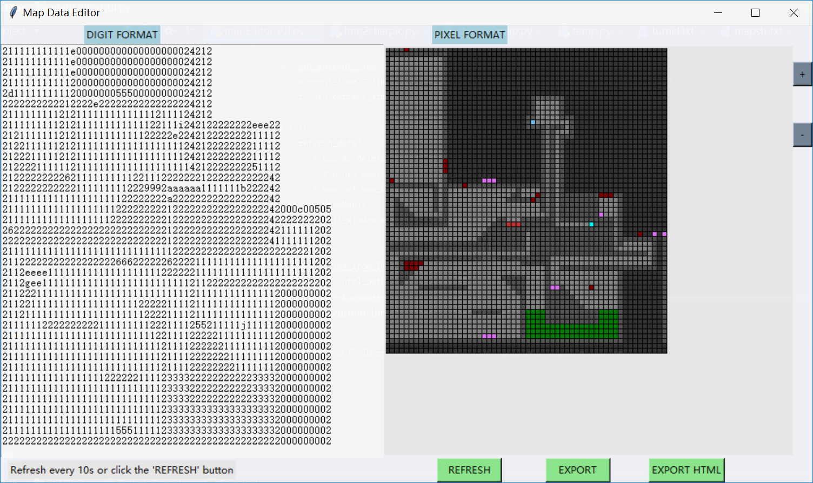
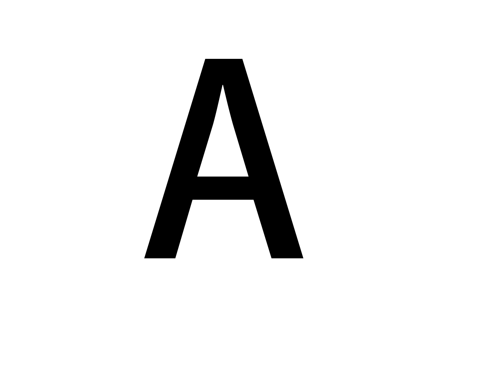
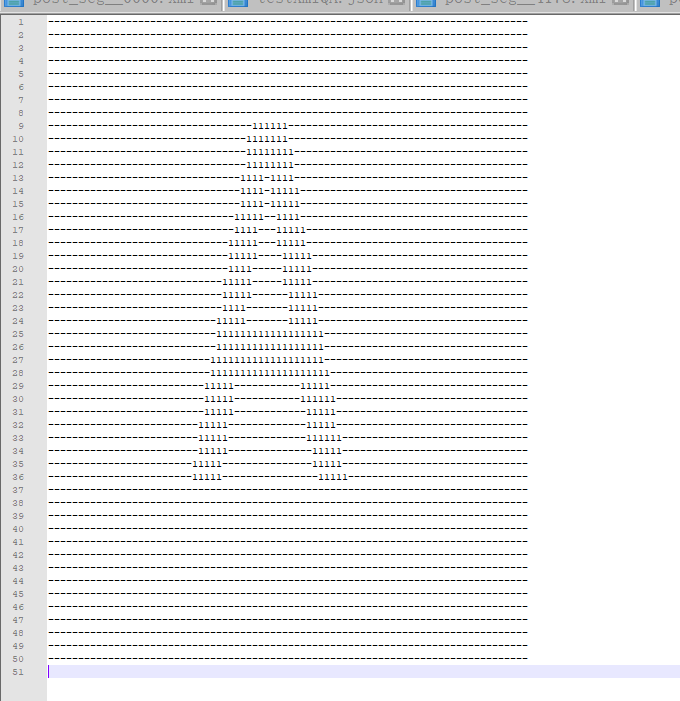

# Naive Python Application Collections 
This project is to record some naive but interesting python applications

|Author|Programming Language
|---|---
|Hang Yu|Python


****
## Index
* [H5 Labyrinth Map Editor](##H5%20Labyrinth%20Map%20Editor)
* [ASCII Character Picture Convertor](##ASCII%20Character%20Picture%20Convertor)

****
## H5 Labyrinth Map Editor
This appliction originates from an html5 Labyrinth game, in which player controls a little ball to escape the maze. In the game, the map can be editted by developer by chaning the initial value of a attribute `data` of a variable `map`, like this:
```
data:[
    [2,2,2,2,2],
    [2,1,1,1,2],
    [2,1,1,1,2],
    [2,1,1,1,2],
    [2,2,2,2,2]
]
```
Thus I develop a python GUI map editor by which developer can directly modify the value without comma and bracket and can immediately see the effect.



### Implementation
It first use Regular Expression to get `data:[[]]` from the html file, then parse string into 2 dimension data and load them into the left text input box. One thing should be mentioned is that the data user directly edited and also showed on the screen is not the same as what is used by the h5 game. According to the MVC model, user-edited data belongs to View rather than Model. This means that the real data should be encoded before loaded into the text box( also for the sake of format ).

The right side of the editor show the map by drawing rectangles simulating pixels. This works well with small-sized maps when the refresh frequency is not very high but this naive solution lacks for scalability.

### Prerequisite
- Python 3.5
- libs: tkinter


****
## ASCII Character Picture Convertor
This application just read a `png` picture (other format needs the support of other libs like `PIL` ) and print its character format with ASCII chars.

It core algorithm is the fomula coverting RGB to grey:
```
 grey = 0.2126 * r + 0.7152 * g + 0.0722 * b
```
and map grey value to corresponding ASCII chars.
```
ascii_char = list("$@B%8&WM#*oahkbdpqwmZO0QLCJUYXzcvunxrjft/\|()1{}[]?-_+~<>i!lI;:,\"^`'. ")
```

The original picture:


The char picture:


### Prerequisite
- Python 3.5
- libs: matplotlib.pyplot